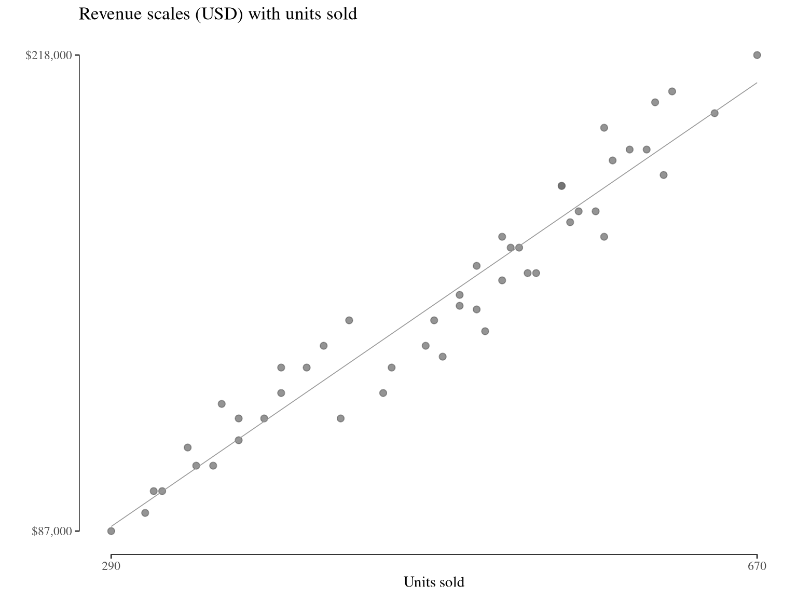

# Plotting in R: Tufte Visualization Principles

This repository contains practice exercises for creating data visualizations in R that follow Edward Tufte's principles of effective graphical design.



## Repository Structure

### Tufte Visualization Exercises (complete)
- `tufte_visualization_exercises.qmd` — main exercises document
- `tufte_visualization_exercises.html` — rendered output
- `sample_data.csv` — dataset used in exercises
- `generate_sample_data.R` — script to regenerate the dataset

### Second Project (work in progress)
- `analysis/` — work in progress
- `data/` — work in progress

## Getting Started

1. Ensure you have R and RStudio or Positron (R IDE) installed
2. Install required packages:
   ```r
   # restore the project environment
   renv::restore()
   ```
3. Open `tufte_visualization_exercises.qmd` in the R IDE
4. Work through the exercises, creating visualizations that maximize data-ink ratio and minimize chartjunk

## Tufte's Key Principles

The exercises cover:
- **Data-ink ratio**: Maximizing the proportion of ink devoted to data
- **Minimizing chartjunk**: Removing unnecessary decorative elements
- **Small multiples**: Using repetition for comparison
- **Integrated text and graphics**: Placing labels close to data
- **Honest representation**: Using appropriate scales and avoiding misleading visuals

## Dataset

The sample dataset includes sales data across:
- 4 years (2020-2023)
- 4 regions (North, South, East, West)
- 3 products (Product_A, Product_B, Product_C)
- Metrics: revenue, units_sold, customer_satisfaction, market_share

## Rendering the Quarto Document

To render the exercises to HTML:
```bash
quarto render tufte_visualization_exercises.qmd
```

Or use the "Render" button in RStudio.
